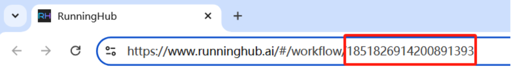

# RunningHub API Readme

## Introduction

> Welcome to the RunningHub API, designed to facilitate the easy use of ComfyUI functionalities hosted on the RunningHub cloud.
> 
> 
> Through this API, you can run various complex workflows in bulk and initiate tasks consecutively. As long as a workflow can run properly on the RunningHub platform, you can seamlessly integrate it into your product or flexibly apply it in any scenario requiring AI workflows.
> 

## Getting Started

> Before using the RunningHub API, please ensure the following preparations are complete:
> 
> 1. First, register as a user on the RunningHub website and activate the membership privileges. Currently, free users cannot access the RunningHub API.
> 2. Open a workflow and note the workflow ID in the address bar, as our API calls are based on this workflow ID.
> 3. For example, in the following URL([Sample workflow](https://www.runninghub.ai/#/workflow/1851826914200891393)), the workflow ID is `1851826914200891393`.
>     
>     
>     
> 4. Make sure to run this flow manually and have it work properly, or you'll get an error when using the API.

## 1. Obtaining the API Key

> RunningHub automatically generates a unique 32-character API Key for each user, serving as the sole identifier for your account.
> 


To view your API Key, open the homepage at [RunningHUB](https://runninghub.ai/), log in to your account, and open the floating profile menu at the top right corner of the page. Keep your API Key secure and do not disclose it, as it will be needed in subsequent steps.


## 2. Simple Workflow Execution

> This method of running a workflow is equivalent to pressing the "Run" button without altering any of the original parameters.
> 
> 
> It is suitable for tasks like drawing random selections.
> 

**Endpoint**: `POST /task/openapi/create`

- **Headers**:

| **Header** | **Value** | **Notes** |
| --- | --- | --- |
| Content-Type | application/json |  |
- **Request Data**:

| **Parameter** | **Type** | **Required** | **Notes** |  |
| --- | --- | --- | --- | --- |
| workflowId | string | Yes |  |  |
| apiKey | string | Yes |  |  |
- **Response**:

| **Parameter** | **Type** | **Notes** |
| --- | --- | --- |
| msg | string | Normally: "success" |
| data: taskId | string | Unique task ID for this run, corresponding to task IDs in the website’s workspace lists |
| data:clientId | string | Client ID for this run, mainly for troubleshooting (usually can be ignored) |
| data:promptTips | string | Error details if any error occurs |
| data:taskStatus | string | Status options: QUEUED (In Queue), RUNNING (Running), SUCCESS (Run Complete and Successful), FAILED (Run Complete and Failed) |
- **Example Code**:

> This workflow execution method is equivalent to pressing the "Run" button without modifying any original parameters. If you'd rather skip the detailed interface description, you can simply copy the following code, replacing workflowId and apiKey with your own values, to get started immediately.
> 

```bash
# Create Task
curl --location --request POST 'https://www.runninghub.ai/task/openapi/create' \
--header 'User-Agent: Apifox/1.0.0 (https://apifox.com)' \
--header 'Content-Type: application/json' \
--header 'Accept: */*' \
--header 'Host: www.runninghub.ai' \
--header 'Connection: keep-alive' \
--data-raw '{
    "workflowId": 1831308605400317953,
    "apiKey": "0bbb4a982e74469381d1c101e1d8673a"
}'

# Response:
{
    "code": 0,
    "msg": "success",
    "data": {
        "taskId": "1850847421957988354",
        "clientId": "17db3f54f9c6bcdfc85e630560cead6e",
        "taskStatus": "RUNNING",
        "promptTips": "{\"node_errors\": {}}"
    }
}

```

## 3. **Advanced Workflow Execution**

> This method is suitable for modifying parameters within workflow nodes, such as changing sampling methods or steps in image generation.
> 
> 
> Any parameter within the nodes can be customized, allowing you to run the workflow with a variety of user-defined settings.
> 

**Endpoint**: `POST /task/openapi/create`

- **Headers**:

| **Header** | **Value** | **Notes** |
| --- | --- | --- |
| Content-Type | application/json |  |
- **Request Data**:

| **Parameter** | **Type** | **Required** | **Notes** |
| --- | --- | --- | --- |
| workflowId | string | Yes |  |
| apiKey | string | Yes |  |
| nodeInfoList:nodeId | int | Yes | The ID of the node to modify |
| nodeInfoList:fieldName | string | Yes | Key of the parameter to be modified |
| nodeInfoList:fieldValue | string | Yes | New value for the specified parameter |
| `nodeId`, `fieldName`, and `fieldValue` constitute one parameter set, and multiple sets can be included to modify various nodes and their parameters simultaneously. |  |  |  |
- **Response**:

| **Parameter** | **Type** | **Notes** |
| --- | --- | --- |
| msg | string | Normally: "success" |
| data: taskId | string | Unique task ID for this run, corresponding to task IDs in the website’s task lists |
| data:clientId | string | Client ID for this run, mainly for troubleshooting (usually can be ignored) |
| data:promptTips | string | Error details if any error occurs |
| data:taskStatus | string | Status options: QUEUED (In Queue), RUNNING (Running), SUCCESS (Run Complete and Successful), FAILED (Run Complete and Failed) |
- **Example Code**:

```bash
# Request:
curl --location --request POST 'https://www.runninghub.ai/task/openapi/create' \
--header 'User-Agent: Apifox/1.0.0 (https://apifox.com)' \
--header 'Content-Type: application/json' \
--header 'Accept: */*' \
--header 'Host: www.runninghub.ai' \
--header 'Connection: keep-alive' \
--data-raw '{
    "workflowId": 1831308605400317953,
    "apiKey": "0bbb4a982e74469381d1c101e1d8673a",
    #The advanced version differs from the simple version by including the ability to define and modify parameters within workflow nodes.
    "nodeInfoList": [
        {
            "nodeId": "6",
            "fieldName": "text",
            "fieldValue": "1 girl in classroom"
        },
        {
            "nodeId": "3",
            "fieldName": "seed",
            "fieldValue": 5
        },
        {
            "nodeId": "20",
            "fieldName": "image",
            "fieldValue": "https://rh-images.xiaoyaoyou.com/60d4973d7f9c2f13144f0bf9c64598d6/output/tensorart_00183__fybyv.png"
        }
    ]
}'

# Response：
{
    "code": 0,
    "msg": "success",
    "data": {
        "taskId": "1850847421957988354",
        "clientId": "17db3f54f9c6bcdfc85e630560cead6e",
        "taskStatus": "RUNNING",
        "promptTips": "{\"node_errors\": {}}"
    }
}

```

## 4. Query Workflow Execution Results

> This method is used to retrieve the output of a workflow run, specifically the result image or other output generated by the workflow's save node.
> 

**Endpoint**: `POST /task/openapi/outputs`

**Headers**:

| **Header** | **Value** | **Notes** |
| --- | --- | --- |
| Content-Type | application/json |  |

**Request Data**:

| **Parameter** | **Type** | **Required** | **Notes** |  |
| --- | --- | --- | --- | --- |
| taskId | string | Yes | The taskId returned from the create API endpoint |  |
| apiKey | string | Yes |  |  |

**Response**:

| **Parameter** | **Type** | **Notes** |
| --- | --- | --- |
| msg | string | Normally: "success" |
| data: fileUrl | string | URL of the image output by the save node in the workflow |
| data:fileType | string | Image format, typically png; can also be audio or video (text txt currently unsupported) |

**Example Code**:

```bash
# Request:
curl --location --request POST 'https://www.runninghub.ai/task/openapi/outputs' \
--header 'User-Agent: Apifox/1.0.0 (https://apifox.com)' \
--header 'Content-Type: application/json' \
--header 'Accept: */*' \
--header 'Host: www.runninghub.ai' \
--header 'Connection: keep-alive' \
--data-raw '{
    "taskId": "1850847421957988354",
    "apiKey": "0bbb4a982e74469381d1c101e1d8673a"
}'
# Response:
{
    "code": 0,
    "msg": "success",
    "data": [
        {
            "fileUrl": "https://www.runninghub.ai/rh-resource-models/10bc565c082353833f12480cd994d8a0/output/comfyui_00029__yxpht.png",
            "fileType": "png"
        }
    ]
}

```

## 5. Query the current status of the account.

**Endpoint**: POST /uc/openapi/accountStatus

- headers：
    
    
    | header | value | **Notes** |
    | --- | --- | --- |
    | Content-Type | application/json |  |
- **Request Data**:
    
    
    | **Parameter** | **Type** | **Required** | **Notes** |  |
    | --- | --- | --- | --- | --- |
    | apikey | string | yes |  |  |
- **Response**:
    
    
    | **Parameter** | **Type** | **Notes** |
    | --- | --- | --- |
    | msg | string | Normally: "success" |
    | data: remainCoins | string | The current balance of RH coins |
    | data:currentTaskCounts | string | Task status: 1 indicates that a task is currently running, and 0 indicates idle. |

```bash
# Request:
curl --location --request POST 'https://www.runninghub.ai/uc/openapi/accountStatus' \
--header 'User-Agent: Apifox/1.0.0 (https://apifox.com)' \
--header 'Content-Type: application/json' \
--header 'Accept: */*' \
--header 'Host: http://www.runninghub.ai' \
--header 'Connection: keep-alive' \
--data-raw '{
    "apikey": "2679cfa89047436796b6830a74064dc0"
}'
# Response:
{
    "code": 0,
    "msg": "success",
    "data": {
        "remainCoins": "105100",
        "currentTaskCounts": "1"
    }
}
```

## 6. upload image\video\audio

**Endpoint**：POST /task/openapi/upload

- headers：
    
    
    | header | value | notes |
    | --- | --- | --- |
    | Content-Type | multipart/form-data |  |
- **Request Data**：
    
    
    | **Parameter** | **Type** | **Required** | **Notes** |
    | --- | --- | --- | --- |
    | apiKey | string | yes |  |
    | file | file | yes | The maximum file size limit is 10MB |
    | fileType | string | yes | Supports image、video、audio |
- Response：
    
    
    | **Parameter** | **Type** | **Notes** |
    | --- | --- | --- |
    | code | int | Normally: 0 |
    | msg | string | Normally: success |
    | data:fileName | string | The file name uploaded to ComfyUI |
    | data:fileType | string | File type uploaded to ComfyUI |
    
    ```bash
    #request：
    curl --location --request POST 'https://www.runninghub.cn/task/openapi/upload' \
    --header 'Content-Type: multipart/form-data' \
    --form 'apiKey="****************************"' \
    --form 'file=@"/mnt/c/tmp/4444.jpg"' \
    --form 'fileType="image"'
    #response：
    {
        "code": 0,
        "msg": "success",
        "data": {
            "fileName": "api/bf431957f5980e7cd0748d46715254987353e9290d11ffef3cc3f326186f5c38.png",
            "fileType": "image"
        }
    }
    ```
    
    The value of the returned fileName field can be filled in the loadImage node through advanced workflow operations：
    
    
    

```jsx
"nodeInfoList": [
        {
            "nodeId": "10",
            "fieldName": "image",
            "fieldValue": "api/bf431957f5980e7cd0748d46715254987353e9290d11ffef3cc3f326186f5c38.png"
        }
    ]
```

## 7. FAQ - Frequently Asked Questions

- In the advanced workflow execution API parameters, what are `nodeId` and `fieldName`?
    
    
    
    > In a workflow, each node has a unique nodeId, and each field within a node has a unique fieldName. Therefore, theoretically, we can use the API to modify any parameter in the workflow.
    > 
- How is billing calculated?
    
    > The API does not have a separate billing system. Running a workflow via the API costs the same as running the same workflow on the website. The API only provides a different way to execute the workflow.
    > 
- I want to use the API concurrently and initiate multiple tasks simultaneously:
    
    > The current API concurrency is tied to the membership privileges. A simple method to achieve multiple concurrent requests is to use multiple accounts and API keys, which can enable concurrency. Furthermore, multiple accounts can call the same WorkflowID. A straightforward implementation would be to configure multiple API keys into a scheduling resource pool to enable concurrent calls. If you are still unclear, you can send these questions to ChatGPT.
    > 
- What if a workflow has multiple save nodes? How does the API respond?
    
    > The API will return multiple results, each corresponding to a save node, in an array under the data field.
    > 
- Return APIKEY_INVALID_NODE_INFO:
    
    > The workflow ID called by the API must have successfully run at least once. Workflows that have never been manually executed successfully cannot be called by the API.
    > 
- How to upload and define images in a diagram: In the advanced workflow API call:
    
    > The `fieldValue` is used to customize the image URL. However, please note that the node used in this example is "load image from URL," and the image URL is defined through the `fieldValue`. Therefore, to use this feature, you should first upload the image to a publicly accessible location, and then set the image URL in the `fieldValue`.
    > 
    > 
    > 
    >